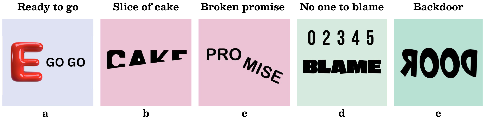

# RebusBench for Evaluating Cognitive Visual Reasoning

[](https://arxiv.org/abs/2604.01764)



This repository contains the full code and dataset structure used in a research project evaluating how well modern Vision‑Language Models (VLMs) can solve **Rebus puzzles**.  
The evaluation pipeline is implemented in a single Jupyter notebook named **`eval.ipynb`**, which loads puzzle images, prompts multiple VLMs, and computes accuracy and F1‑based performance metrics.


---

## 📌 Project Overview

Rebus puzzles are visual wordplay riddles that require multimodal reasoning. This project benchmarks several state‑of‑the‑art VLMs to measure their ability to interpret images with symbolic, spatial, and linguistic cues.

The evaluation includes models from multiple families:

- LLaVA
- InternVL
- Qwen2.5‑VL
- Qwen3‑VL

For each model, the notebook performs:

- Image preprocessing (including InternVL tiling pipeline)
- Structured prompting
- Model inference
- Prediction cleaning and normalization
- Exact‑match accuracy
- Token‑level F1 scoring
- Per‑puzzle result logging
- Aggregated benchmark statistics (`summary.csv`)

---

## 📂 Repository Structure

```
.
├── eval.ipynb                 # Main evaluation notebook
├── data/                # Folder containing all rebus puzzle images
├── Rebus Puzzle.xlsx          # Ground‑truth answers
├── agg_results/               # Auto‑generated evaluation outputs
│   ├── *.csv
│   ├── *.jsonl
│   └── summary.csv
```

---

## 🧠 Evaluation Prompt Used

Every model receives the **exact same, fixed prompt** to ensure fair comparison across VLMs.

```
You are given an image that represents a rebus puzzle (a visual
word riddle).
A rebus puzzle encodes a common English word or phrase using
visual layout, repetition, color, position, or size of text and
symbols.
Do NOT read the image literally.
Instead, infer the hidden word or idiomatic expression suggested
by the visual arrangement.

Examples:
- The word 'MAN' written three times means 'three men'.
- The word 'READ' placed inside a box means 'read between the lines'.
- A red letter 'E' followed by 'GO GO' means 'ready to go'.

Question: What English word or phrase is represented?

Return ONLY the final answer in 1–5 words.
Do not explain.
```

This prompt is stored in the notebook as `PROMPT_MAIN` and is passed to every model’s inference function.

---

## 🧠 How the Evaluation Works

### 1. Load Puzzle Data  
The notebook loads puzzle images from:

```
data/
```

And reads ground‑truth answers from the Excel file:

```
Rebus Puzzle.xlsx
```

Puzzle metadata (`puzzleid`, path, ground‑truth) is wrapped into a custom PyTorch `Dataset` class named **`RebusDataset`**.

---

### 2. Prompting Strategy  
All models receive the **same fixed prompt** (shown above), ensuring controlled, comparable evaluation.

---

### 3. Text Normalization  
Predictions and labels are cleaned using:

- lowercasing  
- punctuation removal  
- whitespace normalization  

This enables robust string comparison.

---

### 4. Metrics  
Two evaluation metrics are computed:

- **Exact Match** — strict correctness  
- **Token‑F1** — similarity between predicted and gold tokens  

Results are logged per puzzle and aggregated per model.

---

### 5. Results Output  
Each model produces:

- `{model_name}.csv` — per‑puzzle scores  
- `{model_name}.jsonl` — raw predictions  
- `summary.csv` — global leaderboard of all evaluated models  

All outputs are written into:

```
agg_results/
```

---

## ⚙️ Installation

To run this project, you need Python ≥ 3.10 and PyTorch with CUDA (optional but recommended).

### 1. Clone the repo
```bash
git clone https://github.com/yourusername/rebus-vlm-benchmark.git
cd rebus-vlm-benchmark
```

### 2. Install dependencies
```bash
pip install -r requirements.txt
```

The notebook uses:

- torch  
- pandas  
- pillow  
- transformers  
- tqdm  
- torchvision  
- openpyxl  

(Ensure these are present in your environment.)

---

## 🚀 Running the Evaluation

1. Place all puzzle images inside:

```
data/
```

2. Ensure the answer file is named:

```
Rebus Puzzle.xlsx
```

3. Open and run the notebook:

```bash
jupyter notebook eval.ipynb
```

4. Execute all cells sequentially.  
   The notebook will:

- load the dataset  
- build inference functions for all registered models  
- run evaluation  
- save results to `agg_results/`  

---

## 📊 Understanding Outputs

Inside `agg_results/`, you'll find:

- per‑model CSV files  
- JSONL files with raw predictions  
- `summary.csv` (the overall leaderboard)

Example per‑puzzle fields:

```
puzzleid, image_path, ground_truth, prediction, exact_match, f1
```

---

## ✨ Notes & Extensibility

- Add new models by editing the `MODELS` list in `eval.ipynb`.  
- Tweak the evaluation prompt if you want to test different reasoning behaviors.  
- InternVL tiling utilities handle high‑resolution images automatically.  

---

## 📄 Citation

```
@inproceedings{kasaei2026rebusbench,
    title={Hidden Meanings in Plain Sight: RebusBench for Evaluating Cognitive Visual Reasoning},
    author={Seyed Amir Kasaei and Arash Marioriyad and Mahbod Khaleti and MohammadAmin Fazli and Mahdieh Soleymani Baghshah and Mohammad Hossein Rohban},
    booktitle={ICLR 2026 Workshop - From Human Cognition to AI Reasoning: Models, Methods, and Applications},
    year={2026},
    url={https://openreview.net/forum?id=LCc2CP4aS4}
}
```
---